# JavaScript-Libraries

#### These are some of the JS Libraries that are being used in development.

#### **NOTE:- This is a community-driven repository, created for the community by the community**

---

# Frontend Libraries

## Major Frameworks

<a href="https://nextjs.org/" target="_blank">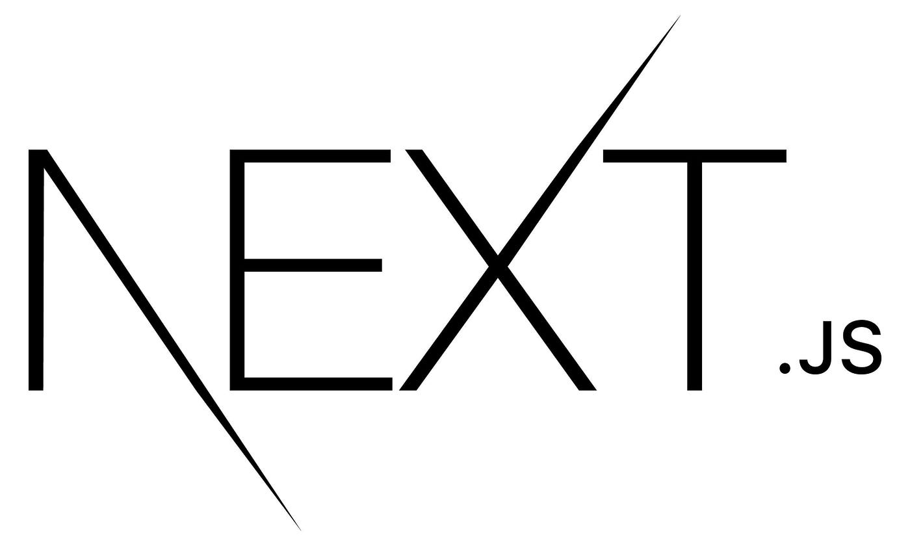</a>

- ### Next.js

Next.js is a React framework for building server-rendered and statically generated web applications.

- ### Vite

Vite is a next-generation front-end build tool that offers super-fast development experience with features like hot module replacement.

---

## UI Libraries

<a href="https://mui.com/" target="_blank">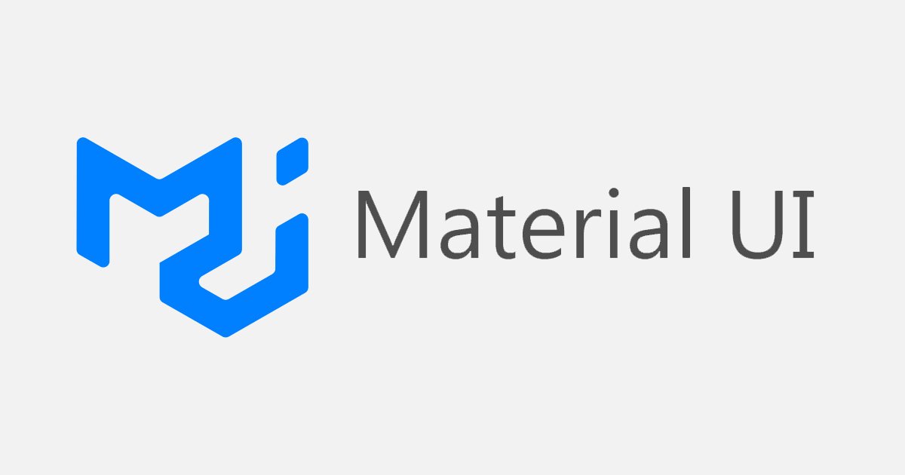</a>

- ### Material-UI

It's based on Google's Material Design guidelines, which means it provides a clean, modern, and consistent look and feel for your applications. Material-UI offers a wide range of pre-built components, including buttons, menus, forms, cards, and more.

<a href="https://v2.chakra-ui.com/" target="_blank">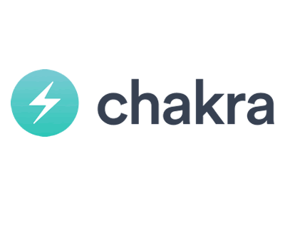</a>

- ### Chakra-UI

Chakra UI provides a small set of core components that can be used to build a wide variety of user interfaces. It also has a strong focus on accessibility and theming.

<a href="https://ui.shadcn.com/" target="_blank">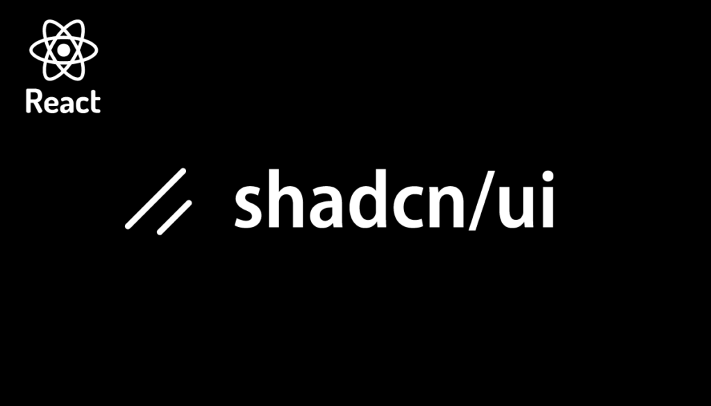</a>

- ### Shadcn-UI

Shadcn-UI provides copy-pasteable, customizable UI components for web apps built with Tailwind CSS and Radix UI.

<a href="https://atomix-ui.vercel.app/" target="_blank">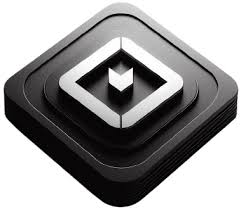</a>

- ### Atomix-UI

Atomix UI is a React component library that follows the principles of Atomic Design. It provides a collection of reusable UI components, such as buttons, inputs, and layouts, that can be easily customized to match your brand's style. This approach helps you build consistent and scalable user interfaces efficiently.

<a href="https://ui.aceternity.com/" target="_blank">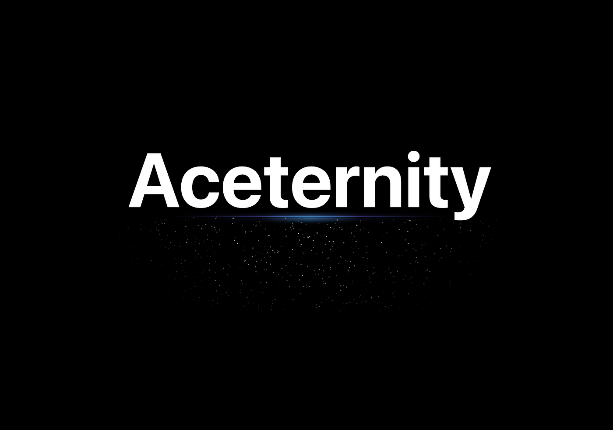</a>

- ### Aceternity-UI

Aceternity-UI is a collection of free, visually appealing React components with a focus on animations and aesthetics.

- ### Ant Design

An excellent option for building enterprise-grade products. It offers a comprehensive set of high-quality UI components that are designed to be performant and accessible. Ant Design also provides a number of features that are specifically tailored for enterprise applications, such as internationalization support and dark mode support.

<a href="https://dotui.org/" target="_blank">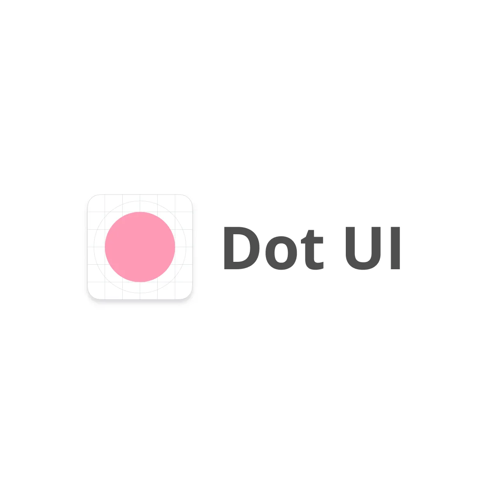</a>

- ### Dot ui

DotUI is a lightweight and efficient JavaScript UI framework designed for building web applications with a focus on simplicity and performance. It utilizes a declarative syntax, allowing developers to describe the desired UI structure and behavior in a clear and concise manner, reducing boilerplate code. DotUI aims to provide a fast rendering experience and a minimal learning curve for developers familiar with basic JavaScript concepts.

---

## CSS Libraries

- ### Tailwind CSS

Tailwind CSS is a utility-first CSS framework that provides pre-defined classes for styling HTML elements directly, allowing rapid development and customization without writing custom CSS.

Note:- A Good Library to go with Tailwind CSS is
**_Tailwind-Merge_** and **_clsx_**

---

## Animation Libraries

- ### Gsap

GSAP (GreenSock Animation Platform) is a JavaScript library that lets you create complex and creative animations for your web projects, giving you precise control over how elements move and change on the screen.

<a href="https://www.framer.com/motion/" target="_blank">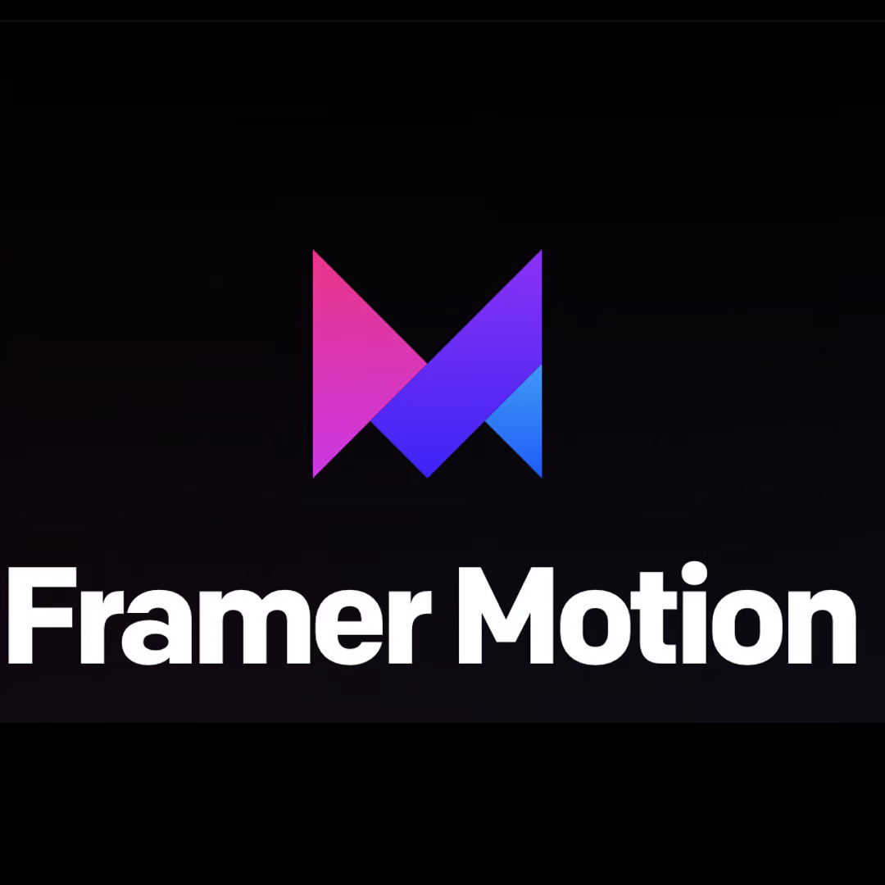</a>

- ### Framer Motion

Framer Motion is a powerful animation library for React that lets you define animations with simple code, making it easy to create engaging and interactive user interfaces.

---

## Scroll Libraries

- ### Locomotive.js
  <a href="https://scroll.locomotive.ca/docs/#/" target="_blank">Website (Click Here)</a>

Locomotive.js is a JavaScript library for creating smooth scroll experiences on websites, allowing you to control and enhance how users interact with your web pages.

<a href="https://lenis.darkroom.engineering/" target="_blank">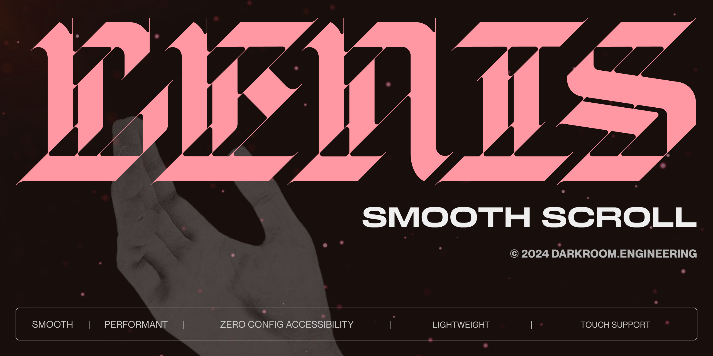</a>

- ### Lenis Scroll

Lenis is a lightweight JavaScript library specifically designed to add smooth, buttery-feeling scrolling experiences to your web projects. It integrates well with other animation libraries for even more creative control.

---

## 3D Libraries

<a href="https://threejs.org/" target="_blank">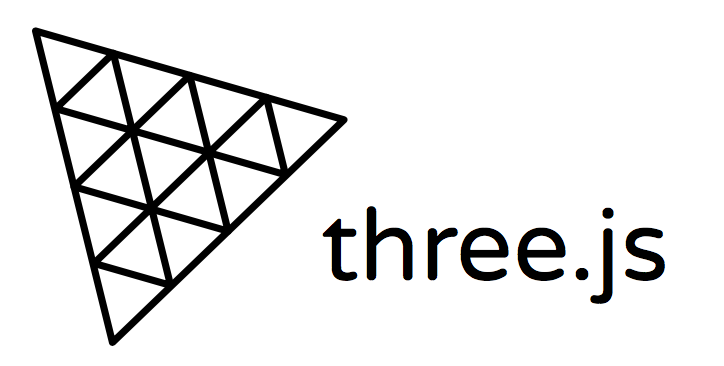</a>

- ### Three.js

Three.js is one of the most popular JavaScript 3D libraries. It is a low-level library that provides a broad set of features for creating and manipulating 3D objects, defining materials, handling camera perspectives, implementing lighting and shadows, and managing animations.

<a href="https://babylonjs.com/" target="_blank">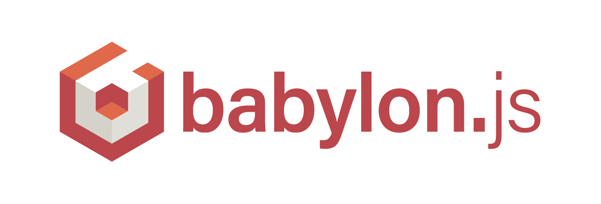</a>

- ### Babylon.js

Babylon.js is another popular JavaScript 3D library that is known for its ease of use and performance. It provides a higher-level API than Three.js, which can make it easier to get started with 3D development. Babylon.js also includes a number of features out of the box, such as physics simulation and particle systems.

- ### Spline.js

Spline.js refers to the JavaScript tools that allow you to embed and interact with 3D scenes created in the Spline web-based design tool within your web applications. Primarily, this involves using the `@splinetool/runtime` library (or `@splinetool/react-spline` for React projects) to bring your Spline designs to life on the web.

---

## Physics

- ### Matter.js

Matter.js is a JavaScript library that provides a 2D rigid body physics engine for web applications. It allows developers to create realistic physics simulations in the browser, handling collisions, gravity, friction, and constraints. Matter.js is lightweight, efficient, and highly customizable, making it suitable for games, animations, and interactive visualizations.

---

## State Management

- ### Redux

A predictable state container for JavaScript applications. It helps you write applications that behave consistently, are easy to test, and can run in different environments (client, server, and native). It provides a centralized store for managing application state

- ### Zustand

## A small, fast, and scalable bearbones state-management solution using simplified flux principles. It's known for its ease of use, minimal boilerplate, and excellent performance for React applications (though it's not strictly tied to React).

## Other Libraries

<a href="https://axios-http.com/" target="_blank">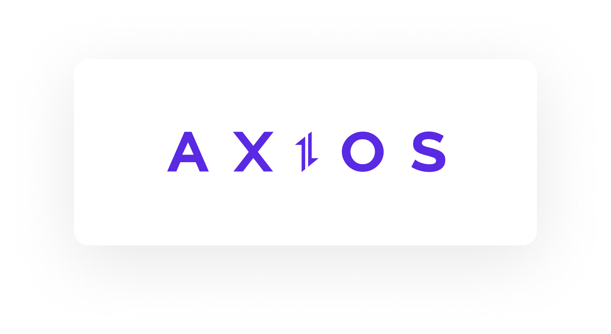</a>

- ### Axios

Axios is a popular JavaScript library for making HTTP requests to servers, simplifying data fetching and handling in web applications.

- ### D3.js

D3.js is a powerful JavaScript library for creating dynamic, interactive data visualizations in web browsers using HTML, SVG, and CSS. It offers unparalleled flexibility for crafting custom and complex visualizations.

- ### Chart.js

A simple yet flexible JavaScript charting library for designers and developers. It supports eight different chart types and provides elegant, responsive, and customizable charts using the HTML5 canvas element.

- ### Pixijs

A fast, flexible, and powerful 2D rendering engine that uses WebGL with canvas fallback. It allows you to create rich interactive graphics, games, and visual experiences for the web.

- ### ReactBits

ReactBits is a curated collection of concise and reusable React patterns, techniques, and practical tips aimed at enhancing the development process. It acts as a valuable resource for React developers of all levels, offering insights into best practices, common solutions to recurring problems, and ways to write more efficient, maintainable, and readable React code. ReactBits often focuses on smaller, digestible pieces of knowledge rather than large, complex libraries.

- ### JQuery

A fast, small, and feature-rich JavaScript library. It simplifies HTML DOM tree traversal and manipulation, event handling, animation, and Ajax with an easy-to-use API that works across a multitude of browsers

# Package Managers

- ### NPM

NPM is a powerful tool that helps JavaScript developers manage and share reusable code packages called "modules". Think of it like a library for JavaScript where you can easily find, install, and use pre-written code for common tasks like making HTTP requests, working with databases, or building user interfaces. This saves developers time and effort by avoiding the need to write everything from scratch.

<a href="https://pnpm.io/" target="_blank">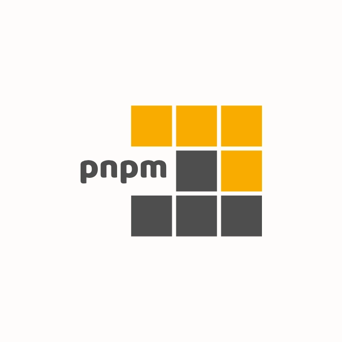</a>

- ### PNPM

PNPM or "Performant Node Package Manager", is a JavaScript package manager that focuses on speed and disk space efficiency. Unlike npm and Yarn, which create separate copies of each package for every project, pnpm uses a global store to save packages. When a package is needed for a project, pnpm creates hard links from the global store to the project's node_modules folder. This approach significantly reduces disk space usage and speeds up installation times, especially in large projects with many dependencies.

<a href="https://yarnpkg.com/" target="_blank">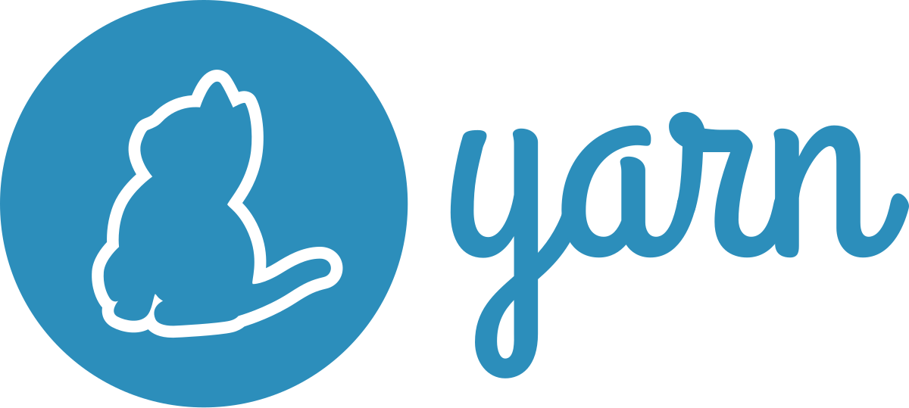</a>

- ### Yarn

Yarn is a package manager for JavaScript that aims to improve upon npm. It focuses on speed, reliability, and security when installing and managing project dependencies. Yarn ensures consistent installations across different environments and provides features like offline caching and a global lock file to streamline the development process.

---

# Backend Libraries

## Major Frameworks

- ### Express

A minimal and flexible Node.js web application framework that provides a robust set of features for building single-page, multi-page, and hybrid web applications 1 and APIs. It's known for its speed and unopinionated nature, allowing developers freedom in choosing components.

- ### Django

A high-level Python web framework that encourages rapid development and clean, pragmatic design. Following the "batteries included" philosophy, it provides many built-in features like an ORM, admin interface, and templating engine, making it suitable for complex web applications.

- ### Flask

A micro web framework written in Python. It's lightweight and modular, giving developers a lot of control over their choice of tools and libraries. Flask is easy to learn and is often used for smaller to medium-sized applications and APIs.

- ### SpringBoot

An open-source Java-based framework used to create standalone and production-grade Spring-powered applications with minimal fuss. It simplifies the configuration and setup process by providing sensible defaults and embedded servers, making it easy to get Java-based backend applications running quickly.

- ### Ruby on Rails

A web application framework written in Ruby. It follows the "convention over configuration" paradigm, which speeds up development by making assumptions about the developer's needs. Rails is known for its developer-friendly syntax and powerful built-in features, making it suitable for a wide range of web applications.

- ### Laravel

A PHP web framework known for its elegant syntax and developer-friendly features. It provides tools for common web development tasks such as routing, authentication, templating, and database interactions, making it a popular choice for building robust and scalable web applications with PHP.

---
